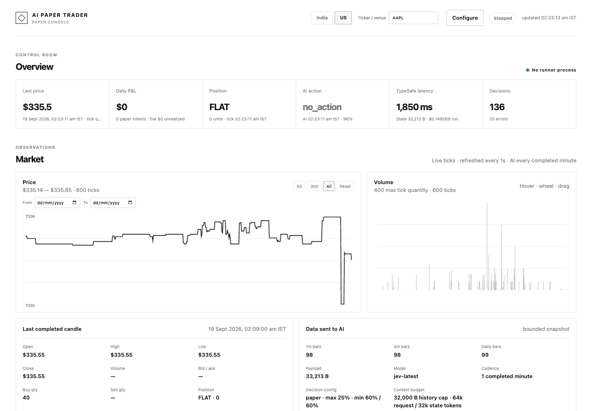
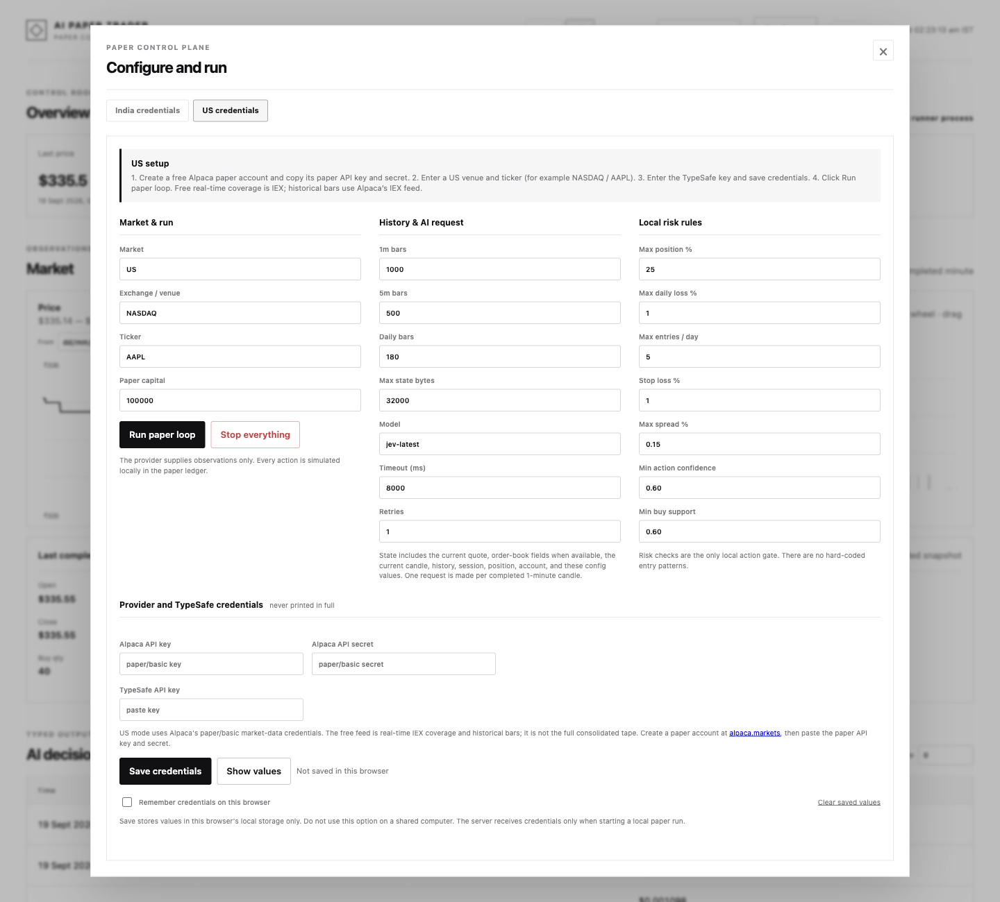

# AI Paper Trader

> A provider-agnostic, TypeSafe-assisted market-observation and paper-trading
> console for US and Indian cash equities.

AI Paper Trader connects to a real-time market-data feed, builds bounded
multi-timeframe context, asks TypeSafe for typed judgments once per completed
one-minute candle, applies explicit local risk rules, and records every result
in a local paper ledger. It is designed for inspection, replay, and research:
it never places, modifies, or cancels a live broker order.

## Features

- **India and US market tabs** in one local dashboard.
- **India provider:** Zerodha Kite Connect full-mode WebSocket ticks and
  historical candles.
- **US provider:** Alpaca stock trades/quotes over WebSocket and historical
  bars over REST. The free/basic path uses IEX real-time coverage and is not a
  consolidated all-venue US feed.
- **Generic ticker and venue selection:** the runner is not tied to a company
  or a single exchange.
- **TypeSafe System One judgments:** action, buy support, regime, setup quality,
  and holding horizon are typed and auditable.
- **Complete AI input context:** quote, available depth, current candle,
  bounded 1m/5m/daily history, venue session state, paper position/account,
  and the active decision configuration.
- **Local risk gate:** stale data, spread, position value, daily loss, trade
  count, confidence, buy support, and stop-loss checks remain deterministic.
- **Paper-only execution:** provider order methods are hard-disabled and the
  command refuses any non-paper mode.
- **Single-page console:** configuration and setup steps at the top, live
  metrics, interactive charts, decision/cost/latency table, paper trades,
  logs, and saved runs on one page.
- **IST presentation:** every dashboard timestamp is displayed in IST while
  session calculations use the selected market's local timezone internally.
- **Reproducible audit trail:** JSONL market/decision logs plus per-run summary
  files under the ignored `runs/` directory.
- **Credential hygiene:** raw credentials are never logged or returned by the
  state API; only set/length/hash-prefix diagnostics are shown.

## Screenshots

The local console keeps market observations, TypeSafe decisions, paper-trade
results, charts, and audit logs on one page.



The **Configure** dialog keeps India and US credentials separate and exposes
the paper-only run controls without putting secrets in the shell.



## How it works

1. The selected adapter resolves the configured cash-equity instrument.
2. Historical 1m, 5m, and daily bars seed a bounded in-memory history store.
3. A full-mode stream produces broker-neutral ticks. Completed one-minute
   candles are built from those ticks; gaps are not invented.
4. At each completed-minute boundary, the runtime snapshots the current quote,
   depth, candle, history, session, paper account, position, and config.
5. TypeSafe receives that JSON state and returns typed answers. Request latency,
   token usage, estimated input cost, and state size are recorded.
6. The local risk gate decides whether a typed intent is eligible for the
   paper ledger. No intent is sent to Kite or Alpaca as an order.
7. The dashboard polls the local state API every second and reads the newest
   event/market files for charts, tables, and logs.

## Repository layout

```text
.
├── adapters.go                 # shared instrument/history adapter contracts
├── candle.go                   # completed one-minute candle builder
├── history.go                  # bounded bars and serialized-state budget
├── risk.go                     # deterministic local risk authorization
├── runner.go                   # one-minute TypeSafe evaluation orchestration
├── runtime.go                  # tick -> candle -> snapshot bridge
├── types.go                    # provider-neutral state and typed outputs
├── typesafe.go                 # TypeSafe System One HTTP client and questions
├── internal/broker/kite        # India/Kite market-data adapter
├── internal/broker/alpaca     # US/Alpaca IEX market-data adapter
├── cmd/paper-trader            # provider selection and paper ledger
└── ui                          # embedded Go server and single-page dashboard
```

## Requirements

- Go 1.21 or newer.
- A [TypeSafe](https://console.typesafe.ai/) account.
- For India, a [Kite Connect](https://kite.trade/) app.
- For US, an [Alpaca paper account](https://app.alpaca.markets/signup).

Credentials are entered in the dashboard's **Configure** dialog. Do not commit
them, place them in `config.example.yaml`, or paste them into an issue. The
example config is intentionally credential-free.

## Configuration

The dashboard exposes these settings and stores non-secret form values in the
current browser's local storage. `config.example.yaml` is a credential-free
reference for the same settings. The lower-level paper-runner command accepts
corresponding flags for advanced automation, but the dashboard is the supported
entry point for normal use.

| Setting | Meaning | Example |
| --- | --- | --- |
| `market` | Provider family | `india` or `us` |
| `exchange` | India exchange or US venue label | `NSE`, `BSE`, `NASDAQ`, `NYSE` |
| `symbol` | Cash-equity ticker | `INFY`, `AAPL` |
| `history-1m` / `history-5m` / `history-1d` | Bars requested and retained | `1000` / `500` / `180` |
| `max-history-bytes` | Serialized history budget sent to TypeSafe | `32000` |
| `typesafe-model` | TypeSafe model | `jev-latest` |
| `typesafe-timeout` / `typesafe-retries` | Request deadline and retry count | `8s` / `1` |
| `max-position-value-percent` | Paper exposure cap | `25` |
| `max-daily-loss-percent` | Paper daily-loss stop | `1` |
| `max-trades-per-day` | Paper entry limit | `5` |
| `stop-loss-percent` | Protective paper stop | `1` |
| `max-spread-percent` | Maximum quote spread | `0.15` |
| `min-action-confidence` / `min-buy-support` | Local confidence gates | `0.60` / `0.60` |

The UI persists these settings as they change. Use **Clear saved values** to
remove the browser-local state.

## Run from the command line

The dashboard is started from the command line, but credentials are supplied
through its **Configure** dialog rather than shell exports or README snippets.
This keeps secrets out of terminal history and makes the India/US credential
sets independent.

```bash
git clone <your-fork-url>
cd ai-paper-trader
go test ./...
go run ./ui
```

Open <http://127.0.0.1:8787>, choose **India** or **US**, enter the provider
credentials and TypeSafe key in **Configure**, then click **Run paper loop**.
The UI passes credentials only to the local paper-runner child process. The
guard is intentional: `-paper=false` exits before a provider connection. There
is no live-mode flag, live order client, or hidden order fallback.

## Run from the dashboard

```bash
go run ./ui
```

Open <http://127.0.0.1:8787> and follow the top-of-page flow:

### India / Kite

1. Select **India**, enter the exchange and ticker.
2. Create a Kite Connect app and configure its redirect URL.
3. Enter the API key and secret; click **Get Kite login URL**.
4. Sign in, copy the one-time `request_token` from the redirect, and paste it
   into **Fresh Kite request token**.
5. Click **Exchange request token**. The returned daily access token fills the
   access-token field.
6. Enter the TypeSafe key, click **Save credentials** only on a trusted
   machine, then click **Run paper loop**.

Kite access tokens are API-key-specific and normally expire daily. Generate a
new one for the same API key whenever the provider rejects the token.

### US / Alpaca

1. Select **US**, enter a venue such as `NASDAQ` and a ticker such as `AAPL`.
2. Create an Alpaca paper account and copy its paper API key and secret.
3. Paste those values and the TypeSafe key, optionally save them locally, and
   click **Run paper loop**.

The free/basic Alpaca path uses the authenticated `v2/iex` WebSocket for
real-time trades/quotes and the historical bars REST endpoint for `1Min`,
`5Min`, and `1Day` data. IEX is not the consolidated SIP tape; the limitation
is stated in the UI and logs so comparisons remain honest.

The page includes **Stop everything**, an adjustable trailing-log-line selector,
interactive price/volume charts, TypeSafe latency and cost per decision, and
saved run summaries. Every timestamp shown in the page is IST.

## Verification

```bash
gofmt -w $(rg --files -g '*.go')
go test ./...
go test -race ./...
go vet ./...
node --check ui/app.js
git diff --check
```

The Alpaca tests use an in-process HTTP server and do not contact a real
account. Add provider-contract tests before changing adapter behavior.

## Disclaimer and license

This project is provided for educational and research purposes only. It is not
investment, financial, tax, or trading advice; it does not promise accuracy,
profitability, suitability, or uninterrupted market data. Paper results are not
live results. Market-data entitlements, delays, outages, timezone changes, and
TypeSafe judgments can all affect observations. Never use this repository to
place real orders without an independent safety review, provider approval, and
the appropriate legal/compliance controls.

The code is released under the [MIT License](LICENSE). Third-party provider
SDKs and APIs remain subject to their own terms, licenses, and data-use rules.

See [CONTRIBUTING.md](CONTRIBUTING.md) for the development checks and
[SECURITY.md](SECURITY.md) for credential-handling guidance.
